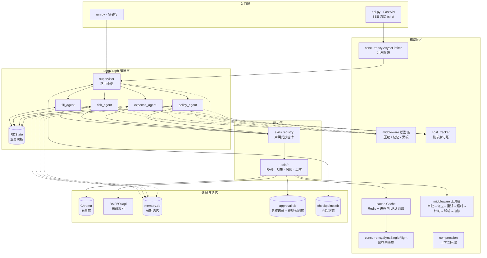
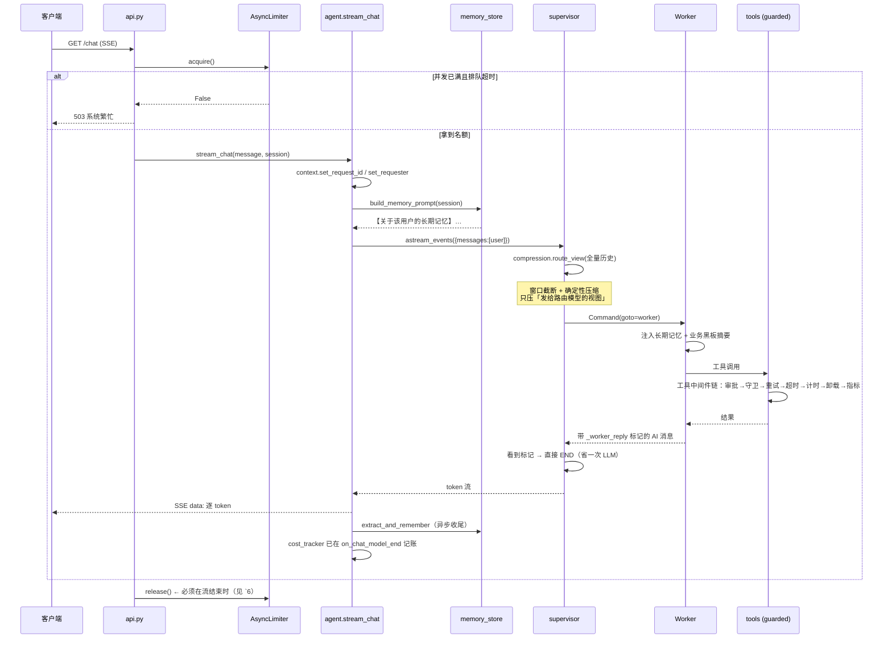

# ARCHITECTURE.md

本文档是**代码地图**：只描述相对稳定的系统边界、目录职责、核心运行链路和架构不变量。
它不替代模块文档、测试规范或源码注释 —— 具体实现请直接读代码。

改动不熟悉的模块前，先读对应章节；再改，最后跑 `pytest tests/ -q`。

---

## 一句话定位

一个**面向研发费用合规场景**的多 Agent 协作系统：用 Supervisor 路由 + 业务黑板共享状态，
把「工时填报 → 人员人工分摊 → 费用归集 → 风险扫描 → 辅助账」串成一条链，
并在关键节点加人工复核（HITL），把人工裁定沉淀成可复用规则。

---

## 鸟瞰

---

## 核心运行链路

一次 `/chat?message=…&session=…` 请求的完整路径：

---

## 目录职责

| 路径 | 职责 | 边界 |
|---|---|---|
| `api.py` | HTTP 适配层：SSE、限流入口、运维接口 | 只做请求模型与响应装配，业务逻辑不写在这里 |
| `agent.py` | 对话用例入口：token 级流式、轮次甄别、兜底取答 | 不直接调工具 |
| `run.py` | 命令行入口 | 与 api.py 共用 `agent.stream_chat` 之外的可复用逻辑 |
| `supervisor.py` | **编排中枢**：RDState 定义、路由决策、Worker 节点、图编译 | 不写业务逻辑，只做调度与状态收口 |
| `context.py` | 请求级上下文（contextvars）：request_id / 记忆 / 发起人 / 黑板草稿 | 只存不判 |
| `config.py` | 单一配置来源（.env + 默认值） | 不做业务判断 |
| `compression.py` | **上下文压缩**：确定性压缩 → 重计量 → 摘要 | 不改原始消息，只产出「请求视图」 |
| `middleware.py` | **中间件链**：模型边界（压缩/记忆/黑板）+ 工具边界（审批/循环守卫/重试/超时/计时/卸载/指标） | **不持有业务规则** —— 审批条件由工具注册进来 |
| `harness.py` | 兼容出口 + LangChain 工具适配（实现已迁到 `middleware.py`） | 不重复实现底层原语 |
| `concurrency.py` | 并发限流 + 缓存防击穿 | 与业务无关的通用件 |
| `cache.py` | 两级缓存门面（Redis → 进程内 LRU 降级） | 降级对上层透明 |
| `cost_tracker.py` | 按「会话 / 模型 / 节点」记账 | 不参与决策 |
| `memory_store.py` | 长期记忆：准入判断 + 读写 + 提示块拼装 | 只记「用户事实」，不记业务数据 |
| `hitl.py` | 人工复核：触发判断、审批记录、裁定复用 | 与 rules.py 共用 approval.db |
| `rules.py` | **规则沉淀**：人工裁定 → 可复用归类规则 + 指标 | 归集口径的唯一事实来源（CATEGORIES） |
| `ledger.py` | 辅助账、汇总表、留存备查清单 | 纯计算，不调模型 |
| `skills/` | **声明式技能库**：SKILL.md 元数据 + handler + eval.json | 可插拔，单包损坏不影响启动 |
| `tools/` | 能力实现（RAG / 归集 / 风险 / 工时 / 数据源） | 通过 context.board_* 写黑板 |
| `tests/` | 测试，重点覆盖**失败路径与不变量** | 真实模型用例由 `MODEL_TESTS=1` 门控 |
| `eval/` | 离线评测（检索 Recall@K、Ragas 忠实度、流式基准） | 与线上链路同源 |
| `outputs/` | 压缩卸载的大工具结果 + 历史原文（运行时产物，已 gitignore） | 只写不读业务 |

---

## 架构不变量

改代码时这些**不能被破坏**，破坏即为引入回归：

1. **原始消息永不因压缩被删除。**
   压缩只产出「发给模型的请求视图」。`state["messages"]` 与数据库记录始终完整。
   （反例：为了防止上下文溢出而直接删历史 —— 用户翻记录会发现丢东西。）

2. **最近 N 条消息不做压缩。**
   `compression.compact_messages` 的 `keep` 是硬边界；Worker 路由视图只保护最新一条，
   因为路由提示词明确写了「只依据最新一条 user 消息」。

3. **工具执行必须经中间件链**（`guarded_tool` → `TOOL_CHAIN.run_tool`）。
   任何绕过它的直接调用都会失去**审批、循环守卫、超时、重试**保护。
   顺序有语义，不能随意调换：**重试必须在超时外层**，否则每次重试不再有独立超时。

4. **超时必须真的超时。**
   `middleware.run_with_timeout` 内部必须手动 `shutdown(wait=False)`，
   不能写成 `with ThreadPoolExecutor(...) as ex:` —— 后者会让超时形同虚设
   （实测：6 秒任务设 2 秒超时，异常在 6.01 秒才出现）。
   **这段实现只允许有一份**，改它请改 `middleware.py`，不要在别处复制。

5. **线程池不继承 contextvars。**
   跨线程执行必须显式 `copy_context()`；跨线程回传数据只能靠**可变对象的原地修改**
   （见 `context._board_draft` 的注释），调 `set()` 换新对象不会回传。

6. **缓存名额在流结束时释放。**
   `limiter.release()` 必须在 SSE generator 的 `finally` 里，不能放在返回 StreamingResponse 之前。

7. **缓存只收「带引用来源的真实回答」。**
   `rag_tool._cacheable` 是准入闸门。拒答 / 异常 / 门控拒绝的回答绝不入缓存 ——
   否则错误答案会被反复命中，且从表面看不出原因。

8. **长期记忆写入必须过准入。**
   `memory_store.is_admissible` 是唯一入口。绕过它直接写库 = 记忆污染。

9. **HITL 审批必须绑定发起人。**
   查找裁定记录时必须带 `requester` 过滤，否则「张三批准过的敏感问题李四会被自动放行」。

10. **技能库装配失败必须降级 + 告警，不能静默。**
    `supervisor._tools_for` 的回退路径是设计的一部分，不是冗余代码。

---

## 关键设计决策（面试常问）

| 决策 | 为什么这么做 | 反面是什么 |
|---|---|---|
| State 用 `Annotated[list, operator.add]` | 多个 Worker 往同一字段写要**追加**不是覆盖 | 只用一个 `messages` → Worker 之间数据链断裂 |
| 业务黑板用**可变 dict + 原地修改** | `copy_context()` 是浅拷贝，原地修改能穿透线程边界 | 用 `set()` 换新对象 → 数据静默丢失 |
| 混合检索 + RRF + 重排 | BM25 与向量**分数不可比**，RRF 只看排名 | 分数加权 → 权重靠拍脑袋，换语料就崩 |
| 路由走**纯文本令牌 + 关键词兜底** | 模型不支持 `response_format` | 只靠 LLM 输出 → 模型不听话时流程卡死 |
| Worker **只收当前轮消息** | 避免上一轮的复核提示/错误回复干扰本轮 | 传全量历史 → 多轮串台 |
| 压缩**两段式**（确定性 → 摘要） | 第一段不花钱，多数请求到此结束 | 直接摘要 → 每次都要一次 LLM 调用，还丢细节 |
| 裁定结果**沉淀成规则** | 人工介入率能持续下降 | 每次都问人 → 人工成本不降 |
| 技能库**声明式** | 加能力 = 加目录，主流程零改动 | 硬编码工具列表 → 改三处漏一处就是事故 |
| 横切关注点收成**有序中间件链** | 顺序显式、可独立观测、强制执行不靠人的自觉 | 散落的装饰器 → 忘了加审批没人拦得住 |
| **审批用注册表**，规则留在工具 | 中间件不被迫知道 `rules` 和黑板 | 把业务耦合的审批搬进中间件 → 业务规则泄露到横切层 |

---

## 运维接口

| 端点 | 用途 |
|---|---|
| `GET /health` | 健康检查 + **缓存后端**（能看出是否降级到本地 LRU）+ 预热结果 |
| `GET /skills` | 能力清单（从技能库元数据生成，与路由提示词同源） |
| `GET /cost` | token 用量与费用（按会话或全局，**能看出钱花在哪个节点**） |
| `GET /compression` | 压缩配置 + **最近一次压缩报告**（省了多少 token、卸载了几个文件） |
| `GET /middleware` | 中间件链顺序 + **各工具的调用指标**（次数/成功率/平均耗时/卸载数） |

---

## 相关文档

- [上下文压缩机制](docs/mechanisms/context-compression.md)
- [长期记忆与来源门控](docs/mechanisms/memory.md)
- [人工复核与规则沉淀](docs/mechanisms/hitl.md)
- [技能库与自动装配](docs/mechanisms/skills.md)
- [中间件链：横切关注点的有序化](docs/mechanisms/middleware.md)
- [技术选型理由](docs/tech_rationale.md)
- [研发费用智能管理系统 · 需求规格说明书](docs/需求规格说明书_研发费用智能管理系统.md)
