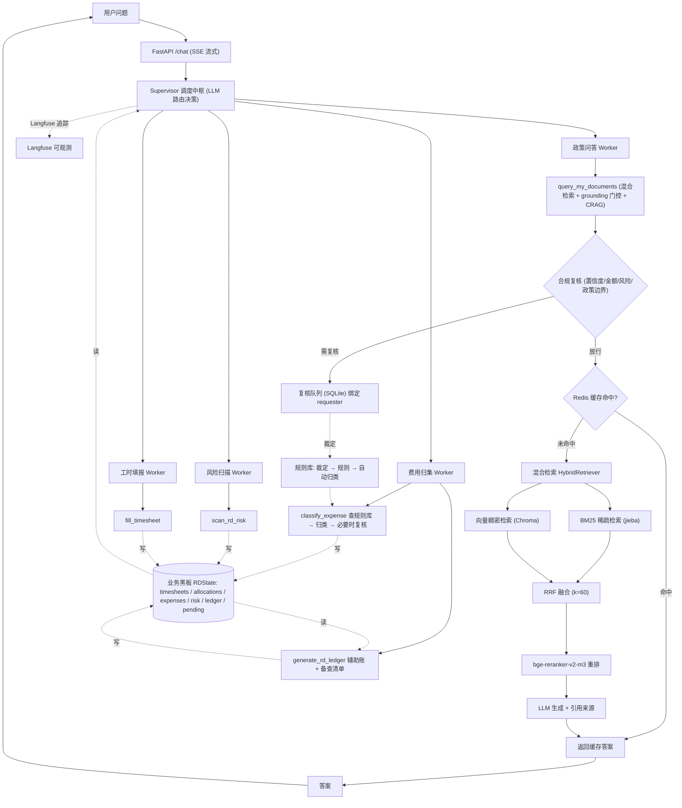

# 研发费用智能管理 Agent 平台（multi-agent-system）

> 面向企业财务 / 税务人员的 **研发费用加计扣除合规助手**。
> 基于 LangGraph Supervisor-Worker 多 Agent + 混合检索 RAG：
> 政策问答、费用归集、风险自查、工时填报四位一体，
> 并输出政策要求的 **研发支出辅助账** 与 **留存备查资料清单**。

> 📖 [技术选型理由（面试速查版）](./docs/tech_rationale.md) ｜ 📋 [需求规格说明书](./docs/需求规格说明书_研发费用智能管理系统.md)

---

## 一、解决什么业务问题

### ① 费用归集：错一次损失几十万

企业享受研发费用加计扣除（**按 100% 加计**），但前提是**费用归集口径正确**。
一笔支出归错类别，轻则少抵税，重则被税务认定为不实申报。

> **本项目的取舍**：这类系统的价值不是「省了几个小时人力」，而是**避免归集错误带来的税务风险**。
> 所以真正的主线是下面这条链。

### ② 政策吃不准

加计扣除涉及 8 类费用口径、7 类负面清单行业、多项限额比例（其他相关费用 ≤ 10%、
研发人员 ≥ 5%、直接投入 ≤ 50%…）。财务不可能都记住，而且**记错就是风险**。

### ③ 交付物做不出来

政策要求企业**建立研发支出辅助账**并**留存备查资料**（财税〔2015〕119 号、
国家税务总局公告 2015 年第 97 号 / 2023 年第 7 号）。

**没有辅助账和备查资料，加计扣除享受不了；税务检查时也拿不出证据。**
财务手工做这张表通常要几天，且是纯体力活。

---

## 二、核心亮点

- **★ 业务主线真的接上了**：工时 → 人员人工按工时占比分摊 → 费用归集 → 风险指标 → 辅助账，
  四个 Agent 通过 **State 业务黑板** 共享数据（原实现是四个互不可见的问答器）
- **★ 合规复核闭环**：归类置信度低 / 单笔超阈值 / 风险黄红灯 / 政策边界模糊 → 人工裁定 →
  **沉淀成规则 → 同类自动归类**；审批记录**绑定发起人**，杜绝跨用户越权
- **★ 交付物生成**：按 8 类口径出研发支出辅助账 + 限额校验 + 人员人工分摊表 +
  7 项留存备查资料清单（逐条标注 已具备 / 待补充）
- **4 个专职 Worker**：政策问答 / 费用归集 / 风险扫描 / 工时填报，职责单一、可独立演进
- **防幻觉四层防线**：grounding 相关性门控 + CRAG 重搜 + 引用来源 + 无来源拒答
- **可靠性工程**：Agent Harness（超时 / 重试 / 日志）+ 死循环双保险 + AST 白名单计算工具
- **并发控制（实测）**：`/health` 轻量接口 100 并发 → **2105 QPS、零错误**；
  `/chat` 真实接口 15 并发 → **10 个正常返回、5 个排队 5 秒后返 503**（保护下游）
- **真 token 级流式**：`astream_events(v2)` 按 `langgraph_node` 只转发 Worker 的最终回答 token
- **技能库（Skill Registry）**：`skills/<name>/SKILL.md` 声明式能力单元，
  新增能力 = 新增一个目录，**主流程零改动**
- **长期记忆 + 三重准入门控**：防**记忆污染**（宁可少写，不可写错）
- **服务预热**：首个请求 **26.6s → 8.2s**
- **可观测与成本**：Langfuse（可选降级）+ 按会话/节点记账

---

## 三、业务主线：一条被接上的数据链

```
① 项目立项 → ② 工时填报 → ③ 人员人工分摊 → ④ 费用归集
                                                ↓
                          ⑤ 风险自查（金四 6 项指标红黄绿）
                                                ↓
                     ⑥ 辅助账生成 → ⑦ 留存备查资料清单
                                                ↓
                          ⑧ 政策问答（贯穿全程）
```

**②③④⑤ 是真实的数据依赖链**（政策要求：人员人工费用按实际工时占比在项目间分摊；
研发人员占比 ≥ 5% 依赖工时数据）。

### 业务黑板（`RDState`）

原实现的 State 只有 `messages`，而且 Worker 节点**只把最后一条用户消息传给它** ——
于是 4 个 Worker 各自回答、互不可见，这条链是断的。

现在 State 里多了一块业务黑板：

| 字段 | 含义 | 谁写 | 谁读 |
|---|---|---|---|
| `projects` | 研发项目 | 立项 | 辅助账 |
| `timesheets` | 工时记录 | `fill_agent` | `expense_agent`（算分摊） |
| `allocations` | 人员人工分摊结果 | `expense_agent` | 辅助账 |
| `expenses` | 归集后的费用条目 | `expense_agent` | `risk_agent`、辅助账 |
| `risk` | 风险扫描结果 | `risk_agent` | 辅助账、下一轮问答 |
| `ledger` | 辅助账汇总 | `generate_rd_ledger` | 下一轮问答 |
| `evidence` | 备查资料清单 | `generate_rd_ledger` | 交付 |
| `pending` | ★ 待人工复核 | 各工具 | 复核终端 |

**实现细节**：工具通过 `contextvars` 写黑板草稿，Worker 节点收口落 State。

> **踩坑记录（面试可讲）**：`harness.guarded_tool` 会给工具加超时（跑在线程池里），
> 而 `copy_context()` 只浅拷贝「变量 → 值」的绑定表 ——
> 线程内对 **dict 的原地修改** 父上下文看得见，但线程内 `set()` **换新对象不会回传**。
> 所以黑板必须是「可变 dict + 原地塞数据」。写成 `set()` 的话本地单测能过，
> 一进并发/线程池就静默丢数据。

---

## 四、合规复核（HITL）

**这不是「隐私审批」，是业务风险复核。**

| 触发条件 | 为什么必须人来定 |
|---|---|
| **归类置信度 < 75%** | 一笔支出同时符合多个口径，归错会导致加计扣除被否 |
| **单笔金额 ≥ ¥100,000** | 大额支出需主管确认 |
| **风险指标黄灯 / 红灯** | 需要判断是否整改、怎么整改 |
| **政策边界模糊** | 知识库检索不到明确依据 |
| **个人薪酬明细** | 人员人工费用含个人薪酬，涉及数据权限 |

**复核产出不是「批准 / 拒绝」，而是「裁定 + 政策依据」** —— 因为它要能沉淀成规则。

### 越权修复（重要）

原实现的三层匹配（精确 / LIKE / 关键词交集）**都不看身份**：

> 张三问「我的工资是多少」→ 批准 → 李四问同一句 → **精确匹配命中 → 自动放行**。

人工审核的目的恰恰是「这笔数据不能随便给」，原实现却变成「批一次，对所有人永久放行」。

**修复**：三层匹配全部绑定 `requester`（默认取当前会话），
旧库里没有发起人的记录统一标为 `legacy:unbound` —— **不删数据，但让它们永远不会被自动匹配命中**。

---

## 五、规则闭环：越用越省人

研发费用归集最大的成本不是算钱，是**同一类支出反复要人判断该归到哪一类**。

```
一笔支出归类不确定 → 写 pending → 人工裁定（裁定 + 依据）
        ↓
learn_from_approval() 沉淀规则
        ↓
下次同类支出 → find_rule() 命中 → 自动归类（不问人）
        ↓
指标：自动归类率 = 自动归类笔数 / 总归集笔数
```

**两个设计取舍**：

1. **关键词用白名单词表，不用分词 / 模型** —— 规则抽错会**持续误杀**
   （比如把「研发」当关键词，所有含「研发」的支出都被归到同一类）。
   宁可少沉淀一条，也不污染规则库。
2. **规则带 `source_approval`** —— 任何一条规则都能回溯到「哪一次复核定下的」。
   没有可追溯性的规则库，用久了没人敢删。

---

## 六、交付物：辅助账 + 留存备查清单

`generate_rd_ledger()` 基于黑板上的归集结果，输出：

1. **研发支出辅助账**（按 8 类口径，含笔数与金额）
2. **限额校验**：其他相关费用 ≤ 可加计扣除总额的 10%
   （加计扣除口径；高企认定是 20%，两者不同）
3. **人员人工分摊表**（按工时占比）
4. **留存备查资料清单**（政策要求的 7 项，逐条标注 已具备 / 待补充）

示例输出：

```markdown
## 二、限额校验（加计扣除口径）
- 其他相关费用：¥6,000.00（占比 11.1%，上限 10%）
- 可计入上限：¥5,355.56
- 结论：🔴 其他相关费用超限 ¥644.44，需调减

## 三、人员人工费用按工时占比分摊
| 智能座舱 | 19,692.31 |
| 智能语音 | 12,307.69 |
```

---

## 七、快速开始

```bash
# 1. 安装依赖
pip install -r requirements.txt

# 2. 配置 .env：DEEPSEEK_API_KEY=sk-xxx

# 3. 构建知识库（data/ 下 txt → Chroma）
python ingest.py

# 4. 启动服务（启动时会预热模型，约 18s；WARMUP_ENABLED=false 可关闭）
python api.py          # http://127.0.0.1:8001 聊天前端
python run.py          # 或 CLI 交互

# 5. MCP 服务器（标准 MCP 工具，stdio）
python mcp_server.py

# 6. 合规复核终端（对 pending 项给出裁定）
python hitl.py

# 7. 跑测试
pytest

# 8. 复现并发压测
python bench_concurrency.py
```

---

## 八、系统架构



---

## 九、技术栈

- **Agent 框架**：LangChain 1.3 + LangGraph 1.2（StateGraph Supervisor-Worker，自定义 `RDState`）
- **LLM**：DeepSeek API（OpenAI 兼容接口）
- **向量检索**：ChromaDB + HuggingFace `bge-small-zh-v1.5`
- **重排**：`bge-reranker-v2-m3` CrossEncoder
- **缓存**：Redis（带降级）
- **持久化**：SQLite（checkpoints / approvals / classification_rules）
- **可观测**：Langfuse（可选降级）
- **服务**：FastAPI（SSE 流式输出）
- **部署**：Docker + docker-compose

---

## 十、项目结构

```
multi-agent-system/
├── run.py              # CLI 入口（日志 / Langfuse / 流式对话）
├── api.py              # FastAPI 接口（SSE 流式输出）
├── supervisor.py       # 多 Agent 编排 + ★ RDState 业务黑板 + 黑板注入/收口
├── harness.py          # Agent Harness：guarded_tool / with_timeout / with_retry
├── context.py          # 请求级上下文（contextvars）+ ★ 黑板草稿 + requester
├── hitl.py             # ★ 合规复核（身份绑定 + 裁定/依据 + 旧库迁移）
├── rules.py            # ★ 归类规则库（裁定 → 规则 → 自动归类率）
├── ledger.py           # ★ 辅助账 + 留存备查资料清单生成
├── concurrency.py      # 并发控制：AsyncLimiter + SyncSingleFlight
├── mcp_server.py       # MCP 服务器（4 个工具暴露为标准 MCP 工具）
├── memory_store.py     # 长期记忆：三重准入门控 + SQLite 持久化
├── cost_tracker.py     # Token 成本埋点
├── cache.py            # 两级缓存（Redis + LRU，自动降级）
├── skills/             # 技能库：声明式能力单元
│   └── <skill>/SKILL.md
├── tools/              # 工具集（归集 / 风险 / 工时 / 检索 / 计算）
├── eval/               # 评测脚本（检索召回 / ragas / 流式基准 / 端到端）
├── tests/              # pytest 单测
├── data/               # 知识库文档（政策库 / 归集 FAQ / 风险指标库）
├── docs/               # 需求规格说明书 + tech_rationale.md
└── bench_concurrency.py# ★ 并发压测（可复现）
```

---

## 十一、测试与评估

- **单元测试**：**92 passed, 1 skipped**（工具数据流、缓存准入、Supervisor 路由回环、
  并发控制、长期记忆准入、技能库装配与容错、成本记账）
- **并发压测**：`python bench_concurrency.py` ——
  `/health` 100 并发 → **2105 QPS 零错误**；`/chat` 15 并发 → **10 成功 / 5 排队 5 秒返 503**
- **检索评估**：`eval/retrieval_eval.py` —— 混合检索 Recall@3 **88%**（单路 61%~72%）
- **流式基准**：`eval/stream_bench.py` —— 冷启动 TTFT 26.6s / 热态 4.9s
- **端到端**：`eval/verify_all.py` —— 身份偏好 → 落长期记忆 → 下轮注入 → 全程记账
- **CI**：`.github/workflows` 在 push/PR 时自动跑 pytest

---

## 十二、面试亮点速记

1. **为什么多 Agent？** 单一 Agent 工具越多路由越乱；按业务拆 4 个专职 Worker，职责单一、可独立演进。
2. **Agent 之间怎么协作？** 不是靠消息传递，是**业务黑板**：工具写草稿 → 节点收口落 State。
   好处是每个 Agent 不需要知道别人是谁（消息传递要指定收件人，对方不在就丢了）。
3. **黑板为什么必须是可变 dict？** `copy_context()` 是浅拷贝绑定表 ——
   线程内原地修改能回传，`set()` 换新对象不能。工具跑在线程池里（Harness 加超时），所以只能原地改。
4. **人工审核怎么防越权？** 审批记录绑定 `requester`，三层匹配全部带身份条件；
   旧的无主记录标记为不可命中（不删数据但失效）。
5. **怎么越用越省人？** 人工裁定 → 沉淀成规则 → 同类自动归类，用**自动归类率**量化。
6. **规则关键词为什么用白名单？** 抽错会持续误杀；宁可少沉淀一条，也不污染规则库。
7. **怎么防幻觉？** grounding 门控 + CRAG 重搜 + 引用来源 + 无来源拒答，四层防线。
8. **怎么保证可靠？** Agent Harness：统一超时/重试/日志/耗时，防死循环双保险。
9. **交付物是什么？** 政策硬性要求的研发支出辅助账 + 留存备查资料清单（不是「顺手加的功能」）。
10. **请求上下文怎么隔离？** `contextvars` 而非模块级全局变量；线程池要显式 `copy_context()`。
11. **冷启动怎么优化？** 模型加载/索引构建从「首个用户请求」挪到「服务启动」，26.6s → 8.2s。
12. **怎么让能力可插拔？** 技能库把「工具 + 提示词 + 评测」打包成带版本的目录，声明式装配。

---

## 十三、许可

本项目采用 [MIT License](LICENSE) 开源 —— 欢迎学习、参考与二次开发。
