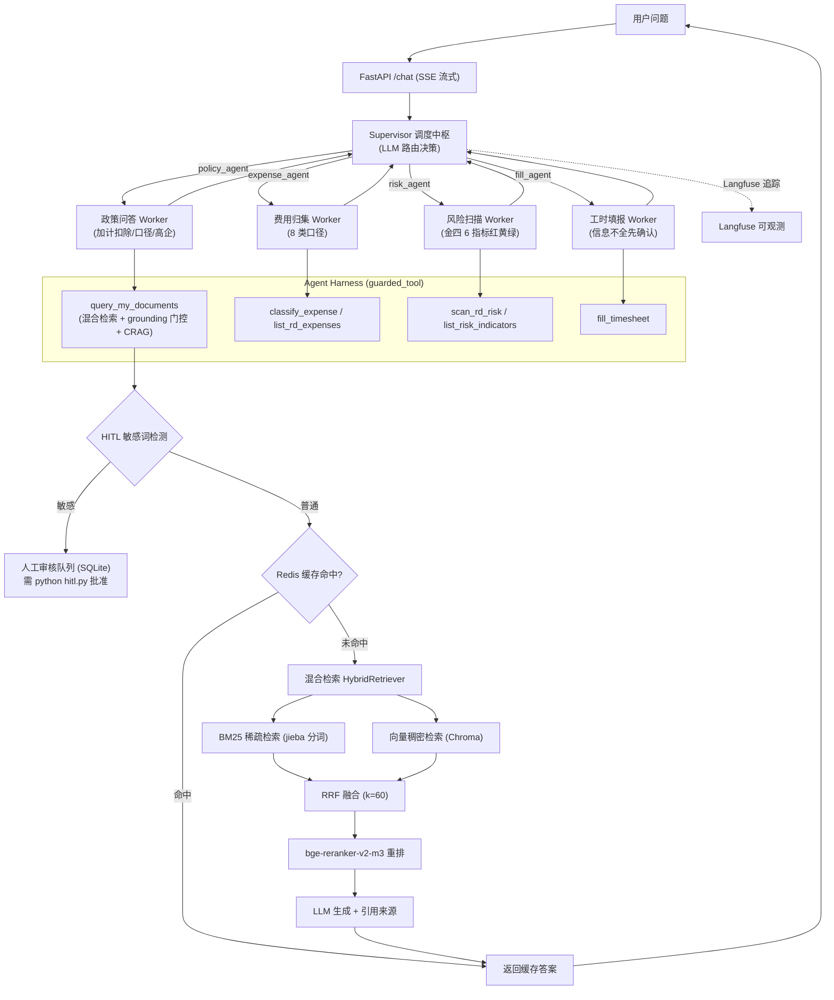

# 研发费用智能管理 Agent 平台（multi-agent-system）

> 基于 **LangGraph Supervisor-Worker 多 Agent + 混合检索 RAG** 的研发费用智能管理助手：政策问答、费用归集、风险扫描、工时填报，四位一体。
> 回答可靠（grounding 防幻觉 + 引用来源）、过程可控（敏感查询人工审核 HITL）、能力可标准化接入（MCP）。
>
> 📖 [技术选型理由（面试速查版）](./docs/tech_rationale.md) ｜ 📋 [需求规格说明书](../研发费用管理系统/需求规格说明书_研发费用智能管理系统.md)

---

## 架构定位：Agent Loop + Harness + MCP

- **Agent Loop**：Supervisor-Worker 循环（路由 → Worker 执行 → 回收 → 再路由），LangGraph StateGraph 驱动；防死循环用 recursion_limit + AgentLoopGuard 双保险。
- **Agent Harness**（harness.py）：工具执行环境与约束层——统一超时 / 有限重试 / 日志 / 耗时统计（guarded_tool 包装所有 Worker 工具），保证"执行可靠、有界、可观测"。
- **MCP 接入**（mcp_server.py）：把费用归集 / 风险扫描 / 工时填报 / 费用条目暴露为标准 MCP 工具（stdio 传输），外部系统或其他 Agent 可通过 MCP 协议调用——"Agent 能力标准化接入"。

---

## 功能特性

| 能力 | 实现说明 |
|------|----------|
| 🤖 多 Agent 编排 | **LangGraph StateGraph 实现的 Supervisor-Worker**：Supervisor 用 LLM 做路由决策，分派给 4 个专职 Worker，协作回路由 `Command` 控制 |
| 🛡️ 防幻觉（grounding） | 检索内容与问题相关性门控（`_is_relevant`），不相关一律拒答"知识库未收录"，绝不编造；回答附引用来源 |
| 🔄 CRAG 重搜 | 检索不足时改写查询重搜一次（`_rewrite_query`），提高召回 |
| 💾 多轮对话记忆 | `AsyncSqliteSaver` 持久化 checkpointer，服务重启后对话历史不丢失；支持 /reset |
| 🔍 混合检索 RAG | BM25（jieba 分词）+ Chroma 向量（bge-small-zh-v1.5）→ RRF 融合 → bge-reranker-v2-m3 重排，Recall@3 **88%** |
| ⚡ Redis 缓存 | 高频问题命中缓存毫秒级返回（`_cacheable` 准入策略：仅带引用来源的答案入缓存）；Redis 不可用时自动降级 |
| 🛡️ HITL 人工审核 | 敏感词命中（我的/个人/工资/薪资/薪酬）触发审核队列，需 `python hitl.py` 批准后才能查询，审核状态持久化 |
| ⏱️ Agent Harness | 工具执行统一包装：超时（10s）/ 重试（2 次）/ 日志 / 耗时（guarded_tool 接入全部 Worker 工具） |
| 🔌 MCP 接入 | mcp_server.py 暴露 4 个工具为标准 MCP 工具（stdio），外部 Agent 可协议调用 |
| 📊 全链路追踪 | Langfuse（可选，未配置自动降级）+ request_id，可视化监控 Token 消耗与响应延迟 |
| 🐳 容器化部署 | docker-compose 一键启动（FastAPI 服务 + Chroma + Redis） |

---

## 核心亮点

- **4 个专职 Worker，各管一段真实业务**：
  - **policy_agent**：研发费用政策问答（加计扣除 100%、8 类费用口径、高企认定、辅助账、留存备查、申报流程）——grounding 门控，知识库没有就明说"未收录"，不编造；
  - **expense_agent**：费用归集——把自然语言描述归类到 8 类口径（人员人工/直接投入/折旧/无形资产摊销/新产品设计费/装配调试/其他相关费用/委托研发）；
  - **risk_agent**：风险扫描——对标金四 6 个比例指标（其他费用≤10%、研发人员≥5%、直接投入≤50%、委托 80%、高企 3/4/5%、波动）输出绿/黄/红预警；
  - **fill_agent**：工时填报——自然语言转工时单，信息不全先确认，不补造数据。
- **可靠性工程**：Agent Harness（超时/重试/日志） + 死循环双保险 + AST 白名单计算工具（防代码注入）；
- **生产级素养**：HITL 人工审核、缓存准入、Redis 降级、上下文 token 预算（检索文档截断 4000 字符）、全链路可观测、CI 自动测试。

---

## 系统架构



---

## 技术栈

- **Agent 框架**：LangChain 1.3 + LangGraph 1.2（StateGraph Supervisor-Worker 多 Agent）
- **LLM**：DeepSeek API（OpenAI 兼容接口）
- **向量检索**：ChromaDB + HuggingFace `bge-small-zh-v1.5`
- **重排**：`bge-reranker-v2-m3` CrossEncoder
- **缓存**：Redis（带降级）
- **记忆**：AsyncSqliteSaver（checkpoints.db）
- **可观测**：Langfuse（可选降级）
- **服务**：FastAPI（SSE 流式输出）
- **部署**：Docker + docker-compose

---

## 项目结构

```
multi-agent-system/
├── run.py              # CLI 程序入口（日志 / Langfuse / 流式对话）
├── api.py              # FastAPI 接口（SSE 流式输出，/chat + 聊天前端）
├── supervisor.py       # Supervisor-Worker 多 Agent 编排（路由令牌 + 兜底路由 + Harness）
├── harness.py          # Agent Harness：guarded_tool / with_timeout / with_retry / AgentLoopGuard
├── mcp_server.py       # MCP 服务器：4 个工具暴露为标准 MCP 工具（stdio）
├── config.py           # 统一配置管理（多源 DATA_SOURCES / .env 热更新）
├── context.py          # 请求 ID 全局上下文
├── exceptions.py       # 自定义异常分类
├── hitl.py             # 人工审核模块（Human-in-the-loop，SQLite 持久化）
├── cache.py            # Redis 缓存（带降级）
├── ingest.py           # 知识库构建（多文件 + 结构切分 + 向量化 + 入库）
├── docker-compose.yml  # Docker 部署编排
├── Dockerfile          # 镜像构建
├── requirements.txt    # 依赖清单
├── data/               # 知识库文档（研发费用政策库 / 归集FAQ / 风险指标库）
├── docs/               # 项目文档与图表（tech_rationale.md 面试速查版）
├── eval/               # 评测脚本（混合检索召回率对比 + ragas）
├── tests/              # pytest 单测（test_tools.py + test_supervisor_agents.py）
├── .github/workflows/  # CI（push/PR 跑 pytest）
└── tools/              # 工具集
    ├── rag_tool.py       # 政策检索（混合检索 + grounding 门控 + CRAG + HITL + 缓存准入）
    ├── expense_tool.py   # 费用归集（8 类口径）+ 费用条目
    ├── risk_scan_tool.py # 风险扫描（金四 6 指标红黄绿）
    ├── fill_timesheet_tool.py # 工时填报（信息不全先确认）
    ├── list_sources_tool.py   # 数据源列表
    ├── math_tool.py      # 通用计算工具（AST 白名单安全防护，供扩展）
    ├── data_clean.py     # 知识库文本清洗
    └── doc_parser.py     # 章节解析（结构切分）
```

---

## 快速开始

```bash
# 1. 安装依赖
pip install -r requirements.txt

# 2. 配置 .env（参考 config.py，填入 DEEPSEEK_API_KEY 等）
#    创建 .env：DEEPSEEK_API_KEY=sk-xxx （模型/Redis/阈值等均可在 config.py 调整）

# 3. 构建知识库（data/ 下 txt → Chroma）
python ingest.py

# 4. 启动服务
python api.py          # http://127.0.0.1:8001 聊天前端
# 或 CLI 交互
python run.py

# 5. 启动 MCP 服务器（标准 MCP 工具，stdio）
python mcp_server.py

# 6. 跑测试
pytest
```

---

## 测试与评估

- **单元测试**：17 passed 1 skipped（工具数据流、缓存准入、Supervisor 路由回环）
- **检索评估**：eval/retrieval_eval.py 对比纯向量 / BM25 / 混合检索召回率（Recall@3 88%，相对纯向量 72% 提升）
- **CI**：.github/workflows 在 push/PR 时自动跑 pytest

---

## 面试亮点速记

1. **为什么多 Agent？** 单一 Agent 工具越多路由越乱；按业务拆 4 个专职 Worker，职责单一、可独立演进；
2. **怎么防幻觉？** grounding 相关性门控 + CRAG 重搜 + 引用来源 + 无来源拒答，四层防线；
3. **怎么保证可靠？** Agent Harness：统一超时/重试/日志/耗时，防死循环双保险；
4. **怎么对外开放能力？** MCP 标准协议，外部系统可协议调用；
5. **生产级素养**：HITL 审核、缓存准入、降级、token 预算、可观测、CI。
