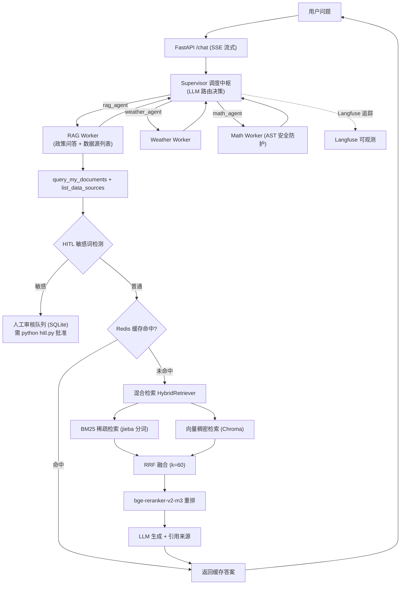
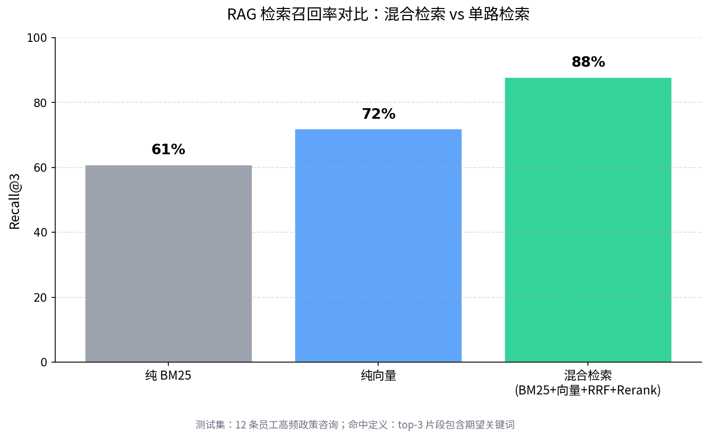

# 企业行政智能助手 · Multi-Agent System

> 基于 **LangGraph Supervisor-Worker 多 Agent + 混合检索 RAG** 的企业内部行政问答系统，自动解答员工关于年假、考勤、报销、出差等高频行政问题，减少 HR 重复劳动。
> 支持多轮对话记忆、BM25+向量混合检索、敏感查询人工审核（HITL）、Redis 缓存与全链路可观测。
>
> 📖 [技术选型理由（面试速查版）](./docs/tech_rationale.md)

---

## 架构定位：Agent Loop + Harness + MCP

- **Agent Loop**：Supervisor-Worker 循环（路由 → Worker 执行 → 回收 → 再路由），LangGraph StateGraph 驱动；防死循环用 recursion_limit + AgentLoopGuard 双保险。
- **Agent Harness**（harness.py）：工具执行环境与约束层——统一超时 / 有限重试 / 日志 / 耗时统计（guarded_tool 包装所有 Worker 工具），保证"执行可靠、有界、可观测"。
- **MCP 接入**（mcp_server.py）：把费用归集 / 风险扫描 / 工时填报暴露为标准 MCP 工具（stdio 传输），外部系统或其他 Agent 可通过 MCP 协议调用——"Agent 能力标准化接入"。

## 功能特性

| 能力 | 实现说明 |
|------|----------|
| 🛡️ Agent Harness | 工具执行统一包装：超时 / 重试 / 日志 / 耗时（guarded_tool 接入全部 Worker） |
| 🔌 MCP 接入 | mcp_server.py 暴露归集/扫描/填报为标准 MCP 工具（stdio），外部系统可协议调用 |
| 🤖 Agent 编排 | **LangGraph StateGraph 实现的 Supervisor-Worker 多 Agent**：Supervisor 用 LLM 做路由决策，将任务分派给 3 个专职 Worker（政策问答 + 数据源列表 / 天气 / 计算），每个 Worker 是独立 `create_agent`，协作回路由 `Command` 控制 |
| 💾 多轮对话记忆 | `AsyncSqliteSaver` 持久化 checkpointer，服务重启后对话历史不丢失 |
| 🔍 RAG 检索增强 | Chroma 向量检索（bge-small-zh-v1.5 embedding）+ `bge-reranker-v2-m3` CrossEncoder 重排，top_n=3 |
| ⚡ Redis 缓存 | 高频问题命中缓存毫秒级返回；Redis 不可用时自动降级为不可用缓存（不影响主流程） |
| 🛡️ HITL 人工审核 | 敏感词命中（我的/个人/工资/薪资/薪酬）触发审核队列，需 `python hitl.py` 批准后才能查询，审核状态持久化 |
| 🔒 AST 安全防护 | 计算工具用 `ast.parse()` + AST 白名单替代 `eval()`，防御代码注入 |
| 📊 全链路追踪 | Langfuse + 请求 ID，可视化监控 Token 消耗与响应延迟 |
| 🐳 容器化部署 | `docker-compose` 一键启动（FastAPI 服务 + Chroma + Redis） |

## 核心亮点

- **多 Agent 协作**：Supervisor 用 LLM 做路由决策，3 个专职 Worker 分别负责政策问答、天气、计算，避免单 Agent 工具越多越乱的问题；
- **混合检索 RAG**：BM25（jieba 分词）+ bge-small-zh-v1.5 向量检索 → RRF 融合 → bge-reranker-v2-m3 重排，Recall@3 **72% → 88%**；
- **人工审核闭环**：敏感查询先写入 SQLite 审核队列，管理员批准后同一问题再次提问即可命中记录并返回结果；
- **安全计算**：`math_tool` 用 AST 白名单替代 `eval()`，防御代码注入。

---

## 系统架构



---

## 技术栈

- **Agent 框架**：LangChain 1.3 + **LangGraph 1.2（StateGraph Supervisor-Worker 多 Agent）**
- **LLM**：DeepSeek API（OpenAI 兼容接口）
- **向量检索**：ChromaDB + HuggingFace `bge-small-zh-v1.5`
- **重排**：`bge-reranker-v2-m3` CrossEncoder（`langchain_classic` ContextualCompressionRetriever）
- **缓存**：Redis
- **记忆**：AsyncSqliteSaver
- **可观测**：Langfuse
- **服务**：FastAPI（SSE 流式输出）
- **部署**：Docker + docker-compose

---

## 项目结构

```
multi_agent_system/
├── run.py              # CLI 程序入口（日志 / Langfuse / 流式对话）
├── api.py              # FastAPI 接口（SSE 流式输出，/chat）
├── supervisor.py       # Supervisor-Worker 多 Agent 编排（工具注册 + 记忆 + checkpointer）
├── config.py           # 统一配置管理（含多源 DATA_SOURCES / .env 热更新）
├── context.py          # 请求 ID 全局上下文
├── exceptions.py       # 自定义异常分类
├── hitl.py             # 人工审核模块（Human-in-the-loop，SQLite 持久化）
├── cache.py            # Redis 缓存（带降级）
├── ingest.py           # 知识库构建（按章节切分多源 + 向量化 + 入库）
├── docker-compose.yml  # Docker 部署编排
├── Dockerfile          # 镜像构建
├── requirements.txt    # 依赖清单
├── data/               # 知识库文档（公司行政管理手册.txt）
├── docs/               # 项目文档与图表
│   ├── tech_rationale.md               # 技术选型理由（面试速查版）
│   └── assets/retrieval_comparison.png # 混合检索召回率对比图
├── eval/               # 评测脚本与绘图
│   ├── retrieval_eval.py   # 纯向量 / BM25 / 混合检索召回率对比
│   ├── plot_retrieval_eval.py
│   └── ragas_eval.py
├── tests/              # pytest 单测（test_tools.py + test_supervisor_agents.py）
├── .github/workflows/  # CI（push/PR 跑 pytest）
└── tools/              # 工具集
    ├── rag_tool.py       # 政策检索（混合检索 + 多源过滤 + HITL + 缓存）
    ├── weather_tool.py   # 天气查询
    ├── math_tool.py      # 数学计算（AST 安全防护）
    └── list_sources_tool.py  # 数据源列表
```

---

## 快速开始

### 方式一：Docker 部署（推荐）

```bash
# 1. 克隆项目
git clone https://github.com/yp1313113-gif/multi-agent-system.git
cd multi-agent-system

# 2. 配置环境变量
cp .env.example .env   # 若没有 .env.example，直接创建 .env
# 编辑 .env，至少填入 DEEPSEEK_API_KEY

# 3. 构建并启动（含 Chroma + Redis）
docker-compose up --build
```

> 首次运行需先构建向量库：在容器内执行 `python ingest.py`（或挂载 data/ 后本地执行）。

### 方式二：本地运行

```bash
# 1. 安装依赖
pip install -r requirements.txt

# 2. 配置环境变量
cp .env.example .env   # 编辑并填入 DEEPSEEK_API_KEY 等

# 3. 构建知识库向量
python ingest.py

# 4. 启动（任选其一）
python run.py          # CLI 交互模式
# 或
uvicorn api:app --reload   # FastAPI 服务（访问 /chat?message=xxx）
```

---

## 核心实现

### 1. RAG 检索管线（混合检索 Hybrid Search + 多源逻辑隔离）
`tools/rag_tool.py` 的 `HybridRetriever` 检索链路：
1. **候选池确定**：若用户指定数据源（如「查考勤库里的年假」），只在对应源切片内检索；否则全库检索；
2. **BM25 稀疏检索**：对候选池文档（中文用 jieba 分词）做关键词召回；
3. **向量稠密检索**：Chroma（bge-small-zh-v1.5）做语义召回，同样带 `where={"source": x}` 过滤；
4. **RRF 融合**（Reciprocal Rank Fusion, k=60）合并两路排名；
5. `bge-reranker-v2-m3` CrossEncoder 对融合结果重排，取 `top_n`；
6. 拼接上下文送入 LLM 生成，并附带引用来源（含 source 标签）。

**多源隔离实现**：所有数据源写入**同一个 Chroma 集合**，每块切片带 `metadata["source"]`；
「切换知识库」= 查询时按 source 做元数据过滤（而非物理分库），既保证召回质量，又实现知识隔离。
配置见 `config.DATA_SOURCES`（当前含：考勤与假期 / 薪酬与福利 / 通用制度 三个逻辑源）。

> 本地验证：运行 `python eval/retrieval_eval.py` 对比纯向量 / 纯 BM25 / 混合三路召回，
> 混合检索相比仅向量召回，Recall@3 由 **72% 提升至 88%**。（数值随测试集与知识库内容变化，可在脚本中复现。）
>
> 
>
> 质量评测另见 `python eval/ragas_eval.py`（Faithfulness / AnswerRelevancy，需 `pip install ragas datasets`）。

### 2. HITL 人工审核
`hitl.py` 用 SQLite 维护审核队列。敏感词命中的查询会写入 `pending` 状态并中断执行，
管理员通过 `python hitl.py` 交互终端 `approve <id>` 后，该问题方可查询，且同一问题不会重复触发审核。

### 3. 缓存与降级
`cache.py` 在 Redis 可用时启用缓存（TTL 默认 3600s），不可用时静默降级，主流程不受影响。

### 4. 安全防护
`math_tool.py` 使用 `ast.parse()` 解析表达式并做 AST 节点白名单校验，杜绝 `eval()` 的代码注入风险。

### 5. 可观测与记忆
- `run.py` 集成 Langfuse `CallbackHandler`，每次请求携带 `request_id` 全链路追踪；
- `AsyncSqliteSaver` 以 `thread_id` 维度持久化多轮对话状态。

---

## 配置说明（.env）

| 变量 | 说明 | 默认值 |
|------|------|--------|
| `DEEPSEEK_API_KEY` | DeepSeek API Key（必填） | — |
| `DEEPSEEK_MODEL` | 模型名 | `deepseek-v4-flash` |
| `CACHE_ENABLED` | 是否启用 Redis 缓存 | `true` |
| `HITL_ENABLED` | 是否启用人工审核 | `true` |
| `LANGFUSE_PUBLIC_KEY` / `LANGFUSE_SECRET_KEY` | Langfuse 凭证（可选） | — |
| `REDIS_HOST` / `REDIS_PORT` | Redis 连接 | `localhost:6379` |

---

## 已知限制 & 路线图

**当前限制（如实说明）：**
- 知识库当前为单份手册按主题切分为 3 个**逻辑源**（考勤与假期 / 薪酬与福利 / 通用制度），尚未接入真实多部门系统；
- RAG 召回与 Ragas 评分为**本地验证数据**，非生产环境真实业务指标；
- 当前为单人独立开发的原型，未接入真实企业系统（HRIS / OA），无真实用户与生产压测。

**后续规划：**
- [x] 多源逻辑隔离（按 source 元数据过滤，已实现）；
- [x] RAG 评测脚本（Ragas Faithfulness / AnswerRelevancy）+ pytest + GitHub Actions CI；
- [ ] 部署公开可演示 demo / 录制演示视频，沉淀真实使用证据；
- [ ] 接入真实企业系统，验证生产级稳定性与成本。

---

## 许可证

MIT（示例代码，仅供学习交流）。
