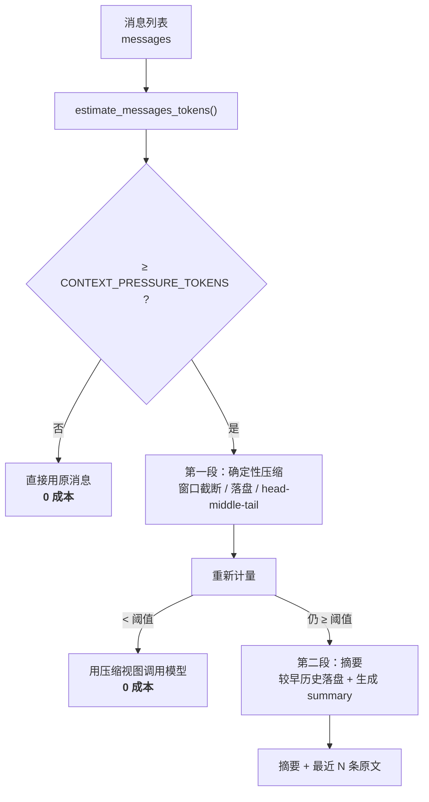

# 上下文压缩机制

长对话和大段工具结果会占用模型上下文。本系统用**两段式压缩**控制它：
先做**确定性压缩**（不调模型、不花钱、结果可复现），重新计量后仍超阈值才调摘要模型。

> 实现：`compression.py`｜配置：`config.COMPRESSION_ENABLED` 等｜观测：`GET /compression`

---

## 先记住三件事

1. **原始消息不会因为压缩被删除。** 压缩只产出「发给模型的请求视图」；
   `state["messages"]` 与 `checkpoints.db` 里的记录始终完整。
2. **确定性压缩优先于摘要。** 多数请求在第一段就结束了 —— 这是成本的主要来源。
3. **token 数是近似估算**，只用于压力判断和预览长度，**不是计费口径**。
   真实计费以 `cost_tracker` 记录的主模型 usage 为准。

---

## 自动压缩流程



关键点：**第二段是唯一会花一次 LLM 调用的分支**，而且只有第一段压不动时才走。

---

## 第一段：确定性压缩

三个分级策略，从便宜到贵：

### ① 结构化结果 → 按字段白名单瘦身（`compact_structured`）

如果工具返回的是可解析 JSON，按「骨架字段」保留，丢弃冗长详情：

- 保留：`count / total / id / ids / source / title / url / score / name / sku / status / category / amount / success`
- 长列表（> 20 项）标记 `_truncated: true` 并保留 `_total`（**总数必须留**，否则模型会以为只有 20 条）
- 嵌套深度 ≥ 3 直接摘要成 `<list[n]>` / `<dict[n]>`

**为什么单独处理结构化结果**：JSON 里 80% 的体积往往是冗长的嵌套详情，
而「数量、ID、来源、分数」这些骨架信息才是模型需要的。
直接 head/tail 截断会把 JSON 截成语法不合法的半截，模型读不懂。

### ② 超大文本 → 完整落盘，请求里只留「路径 + 哈希 + 预览」（`compact_tool_result`）

超过 `SUMMARY_TOOL_RESULT_TOKEN_LIMIT`（默认 800 token）的纯文本：

```
[大工具结果已卸载到文件，完整内容不在上下文中]
路径：outputs/large_tool_results/query_my_documents-0b52f7b4bb23.txt
sha256：0b52f7b4bb23...
原始约 24000 字符 / 约 16820 token。以下为前 200 token 预览：
---
…
---
```

文件名 = **工具名 + 内容前 12 位哈希**。同一内容重复落盘会稳定落在同一个文件，
不会攒出一堆重名副本。

### ③ 其他文本 → head + middle + tail（`head_middle_tail`）

按 40% / 20% / 40% 分配预算。

**为什么不能只留开头**：工具结果的**结论通常在末尾**（「综上，风险为红灯」
「建议安全库存调整为 10」），砍掉尾巴等于把答案砍了。

---

## 路由请求视图（`route_view`）

Supervisor 的路由调用是**每一轮都要跑**的，所以这一层刻意**不做摘要** ——
每次都调一次摘要模型，省下的 token 还不够付那次调用（摘要器本身也要读完历史）。

路由视图只做两件零成本的事：

1. **窗口截断**：只保留最近 `ROUTE_CONTEXT_WINDOW`（默认 12）条；
2. **确定性压缩**：对窗口内的大块内容做落盘 / head-middle-tail。

> ⚠️ 两个踩过的坑，写在 `route_view` 的注释里以免被改回去：
> - 传 `keep=window` → 窗口内每一条都被划进保护名单，**一条都压不动**
>   （实测：一个几十 K 的工具结果原样送进路由请求）；
> - 传 `keep=2` → 倒数第二条如果是大块工具结果，同样逃过压缩。
>
> 最终取 `_ROUTE_KEEP_RAW = 1`：只保护最新一条。
> 依据是路由提示词里明确写了「只依据最新一条 user 消息选择 Worker」。

**实测效果**：42 条消息（最后一条是大工具结果）→ 路由请求
**17052 token 降到 421 token**，卸载 1 个文件。

---

## 第二段：摘要（`summarize_history`）

只有第一段压完仍超阈值才执行：

1. **较早历史原文先落盘** 到 `outputs/conversation_history/`
   —— 摘要是有损的，原文必须还能查到；
2. 调摘要模型，用 `SUMMARY_PROMPT` 生成一条 summary 消息；
3. 结果为 `[summary] + 最近 SUMMARY_KEEP_MESSAGES 条原文`。

摘要提示词的硬性要求（针对本项目场景）：

> **数字必须原样保留**（金额、比例、期限、工时、订单号、日期），一个都不能改。

这不是通用要求，是因为本系统处理的是**政策与金额** ——
摘要里把「100%」写成「较高比例」，整段上下文就废了。

**失败降级**：摘要模型报错时不中断主流程，退化为确定性压缩结果，
并在报告里标明 `摘要失败(...)`，**不会声称自己做了摘要**。

---

## 检索上下文拼装（`fit_context`）

`tools/rag_tool.format_docs` 已改为委托给它，预算来自 `RAG_CONTEXT_MAX_CHARS`（默认 4000 字符）。

相比原来的「累加到超预算就整篇丢弃」，多做一步：
**单篇文档自身就超过预算份额时做 head+middle+tail**，而不是直接截断。

差别在「只召回了一篇超长文档」时最明显：后者让模型拿到半句话，前者至少保留了开头、中段和结尾结论。

---

## 报告与观测

每次压缩产出一个 `CompressionReport`：

```python
{
  "level": "none" | "deterministic" | "summarized",
  "reason": "确定性压缩后已低于阈值，跳过摘要模型（省一次 LLM 调用）",
  "budget_tokens": 6000,
  "trigger_tokens": 8420,      # 压缩前
  "final_tokens": 369,         # 压缩后
  "saved_tokens": 8051,
  "saved_ratio": 0.956,
  "compacted": 1,              # 被确定性压缩的消息数
  "summarized": 0,             # 被摘要的历史条数
  "offloaded": ["outputs/large_tool_results/query_my_documents-0b52f7b4bb23.txt"],
}
```

- 日志：`[compression] level=deterministic 估算 17052→421 token（省 16631）…`
- 接口：`GET /compression` 返回当前配置 + **最近一次报告**

---

## 配置项

| 环境变量 | 默认 | 说明 |
|---|---|---|
| `COMPRESSION_ENABLED` | `true` | 总开关 |
| `CONTEXT_PRESSURE_TOKENS` | `6000` | 压力阈值（近似 token），超过才触发 |
| `SUMMARY_TOOL_RESULT_TOKEN_LIMIT` | `800` | 单条工具结果超过它就落盘 |
| `TOOL_RESULT_PREVIEW_TOKENS` | `200` | 落盘后保留的预览长度 |
| `SUMMARY_KEEP_MESSAGES` | `6` | 摘要时保留最近多少条原文 |
| `ROUTE_CONTEXT_WINDOW` | `12` | 路由视图保留的消息条数 |
| `RAG_CONTEXT_MAX_CHARS` | `4000` | 检索上下文拼装预算（字符） |

---

## 测试

`tests/test_compression.py`，23 项。重点验证**失败路径与不变量**而非「正常能跑」：

| 不变量 | 对应测试 |
|---|---|
| 压缩后 token 必须真的下降 | `test_route_view_compacts_large_result_inside_window` |
| 最近 N 条必须原样保留 | `test_compact_messages_preserves_recent` |
| 传入的消息列表不能被就地修改 | `test_compact_messages_does_not_mutate_input` |
| 结构化瘦身不能丢骨架字段 | `test_compact_structured_keeps_skeleton` |
| 超大结果必须完整落盘 | `test_huge_tool_result_offloaded_with_hash` |
| 同内容落盘必须同文件 | `test_same_content_same_file` |
| 未达阈值必须零成本 | `test_maybe_compress_below_threshold_costs_nothing` |
| 第一段够用就不能调摘要 | `test_maybe_compress_deterministic_is_enough` |
| 摘要失败必须降级不能崩 | `test_summarize_failure_degrades_gracefully` |
| 跨盘符不能抛异常 | `test_huge_tool_result_offloaded_with_hash`（曾在 tmp_path 上暴露 `os.path.relpath` 的 ValueError） |
