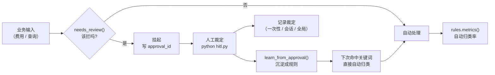

# 人工复核（HITL）与规则沉淀

在关键节点插入人工裁定，并把裁定结果**沉淀成可复用规则**，让人工介入率持续下降。

> 实现：`hitl.py` + `rules.py`｜存储：`approval.db`｜入口：`python hitl.py`

---

## 设计目标

不是「加一个人工确认弹窗」，而是形成闭环：



**闭环的意义**：人工不是常态。裁定一次，规则记住一次，人工介入率就该下降一次。

---

## ① 触发条件：业务风险信号，不是隐私关键词

```python
def needs_review(kind, payload) -> tuple[bool, str]
```

五条触发：

| 触发 | 阈值 | 为什么 |
|---|---|---|
| 低置信度 | < `CONFIDENCE_FLOOR`（0.75） | 模型自己都不确定 |
| 大额费用 | ≥ `AMOUNT_THRESHOLD`（100,000） | 出错代价高 |
| 风险黄灯 / 红灯 | `risk_scan` 结果 | 已经触发合规预警 |
| 政策边界问题 | `kind="policy_boundary"` | 「这笔算不算研发活动」需要判断 |
| 个人薪酬明细 | `kind="salary_detail"` | 同时涉及数据权限与个人隐私 |

**为什么不用关键词表**：在研发费用场景里，「工资」「薪酬」是**业务术语**
（人员人工费用本来就含薪酬），不是隐私词。用关键词会误伤一大片正常查询。

判断依据应该是「这件事的后果有多严重」，不是「这句话里有没有敏感字」。

---

## ② 审批必须绑定发起人

```python
request_approval(..., requester=None)
```

`_find_approved` 在三层存储里查找时**每一层都带 `requester` 过滤**，
查不到归属的归入 `LEGACY_REQUESTER = "legacy:unbound"`（不会被误当成「已授权」）。

> **这是修复一个真实越权漏洞**：原实现不绑身份，导致
> 「张三批准过的敏感问题，李四问同一句话会被自动放行」。
> 真实多用户部署时这里应该是登录用户 ID；本项目是单机应用，用会话标识代替。

`context.set_requester(session)` 在 `agent.stream_chat` 入口设置，
经 `contextvars` 传递到工具线程（`harness.with_timeout` 里显式 `copy_context()`）。

---

## ③ 裁定通过不是永久放行，是「消费一次」

```python
hitl.consume_approved_query(question, "rag_search")
```

批准之后标记为已消费，下次同样的提问还要重新走流程。
「批准过一次」不代表「永远批准」，金额类场景尤其如此。

---

## ④ 规则沉淀（`rules.py`）

`learn_from_approval(approval_id)`：把一次裁定变成一个可复用的归类规则。

**两道闸防止规则库被污染**：

1. **关键词白名单**（`KEYWORD_WHITELIST`）—— 只有命中业务白名单的词才允许沉淀，
   防止抽到「这个」「一下」这类噪音词；
2. **只用人工确认过的裁定** —— 模型自己推断的不算，因为一次误判会被永久固化成「事实」。

规则表带 `hit_count`，可以看出这条规则是否真的在起作用。

`CATEGORIES`（8 类研发费用口径）在 `rules.py` 里定义，是**单一事实来源**，
`tools/expense_tool.py` 从它引入 —— 避免口径在两处漂移。

---

## ⑤ 指标（`rules.metrics()`）

```python
{
  "total": 128,
  "auto": 109,
  "manual": 19,
  "auto_rate": 0.852,      # 自动归类率
}
```

**把「沉淀机制有没有用」变成可以看的数字**，而不是靠感觉。

> 同类思想在 `ecom-ops-agent` 也有：库存水位人工确认后沉淀成规则，
> 12 轮闭环仿真里人工介入率从第 1 轮 100% 收敛到第 12 轮 15%。

---

## 与 `context.py` 的关系

`_current_requester` 用 `ContextVar` 而非全局变量：

- 并发下全局变量会被其他请求覆盖 → 审批归属错乱（比日志串台严重得多）；
- 线程池不自动继承 → `harness.with_timeout` 里显式 `copy_context()`。

---

## 已知不足

| 不足 | 改进方向 |
|---|---|
| 裁定入口是命令行脚本 | 接 Web 审批页 / 企业微信审批 |
| 规则只有关键词匹配 | 加向量相似度匹配，覆盖同义表达 |
| 无规则过期 / 复审 | 政策变更后旧规则应失效 |
| 三层裁定无优先级可视化 | `/rules` 接口暴露命中来源 |
