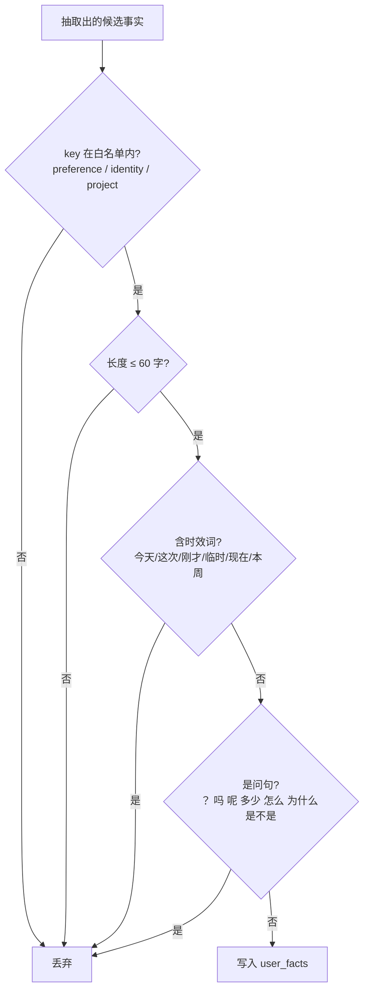

# 长期记忆与来源门控

跨会话记住「关于用户的事实」，下次对话开始时回读并注入。

> 实现：`memory_store.py`｜存储：`memory.db`（SQLite）｜注入点：`supervisor._make_worker_node`

---

## 三层记忆的分工

| 层 | 内容 | 生命周期 | 存储 |
|---|---|---|---|
| **会话记忆** | 对话上下文 | 本次会话 | LangGraph `AsyncSqliteSaver` 按 `thread_id` |
| **长期记忆** | 关于用户的事实（偏好 / 身份 / 常用项目） | 跨会话 | `memory.db` 的 `user_facts` 表 |
| **业务数据** | 本会话产生的业务状态（工时 / 分摊 / 费用 / 风险） | 本次会话 | `RDState` 业务黑板 |

三者不能混在一张表里：生命周期不同、注入策略不同、污染风险也不同。

---

## 核心风险不是「记不住」，是「记忆污染」

用户随口一句被永久记住，之后**每一次**回答都被这条错误记忆带偏，而且很难发现。
所以写入侧做了**三重准入**（`is_admissible`）：



**为什么拒问句**：用户在提问，不是在陈述自己的事实。「加计扣除比例是多少」不是用户画像。

**为什么拒时效词**：那是「当下状态」，不是「用户事实」。记住「今天想查政策」没有任何价值。

**为什么限 60 字**：防止把整段对话塞进来。

配合表结构 `PRIMARY KEY (session_id, key)` 做主键 upsert —— **同一个 key 是覆盖不是追加**。
所以单个 session 的记忆上限是可控的：**3 条 × 60 字 ≈ 180 字**。

> 这是「入口严把关」策略：准入做严了，后面就不用做复杂的淘汰。

---

## 读取侧：来源门控

不是所有记忆都该被使用。每条记忆带一个 `source`：

- `user_confirmed` —— 用户明确说过的，可以直接当默认值用；
- `inferred` —— 系统自己推断的，**默认不参与召回**。

同理，电商项目（`ecom-ops-agent/memory.py`）里 `recall()` 的 `allow_inferred` 默认为 `False`。

**理由**：一次误判不能被固化成「事实」。记忆错了比没有记忆伤害更大 ——
它会以一种很自信的语气把回答带偏，用户还看不出来。

---

## 注入点：只注入 Worker，不注入 Supervisor

```python
# supervisor._make_worker_node
memory = context.get_memory_prompt()
if last_human is not None and memory:
    last_human = HumanMessage(content=f"{memory}\n\n{last_human.content}")
```

**为什么路由不注入**：记忆里的词（「偏好」「项目」）会干扰路由令牌的匹配，把路由带偏。
路由只应该依据用户原话。

---

## 抽取（`extract_and_remember`）

在主流程结束后**异步**执行，失败不影响回答：

1. 用 `EXTRACT_PROMPT` 让模型输出一个 JSON（只允许三类 key）；
2. `parse_facts_json` 稳健解析：容忍 markdown 代码块包裹、前后多余文字、
   以及模型把值返回成列表（`{"identity": ["财务负责人"]}` → 归一化成字符串，
   否则会存成 `"['财务负责人']"` 这种脏值污染后续所有提示词）；
3. 过 `is_admissible` 准入；
4. 写入。

**这一调用也要记账**（`cost_tracker.record_message_usage`），
否则「记忆抽取」这部分成本会被系统性低估。

---

## 已知不足与改进方向

| 不足 | 影响 | 改进方向 |
|---|---|---|
| 全量召回（最多 3 条） | 记忆量大时无法扩展 | 超阈值后改向量召回 + 相似度阈值 |
| 无使用频次衰减 | 陈旧记忆一直参与 | 按命中频次 / 时间衰减权重 |
| 无 TTL | 过期偏好永久生效 | 支持按 key 配置有效期 |
| 无写入前语义去重 | 同一事实可能换个说法各存一份 | 写入前与已有记忆做相似度比对 |
| 会话标识代替登录用户 | 单机场景够用，多用户不安全 | 接入真实鉴权，`(tenant, user)` 做 key |

> 「什么时候**不**召回」比「怎么召回」更难：召回错的记忆比不召回伤害更大。
