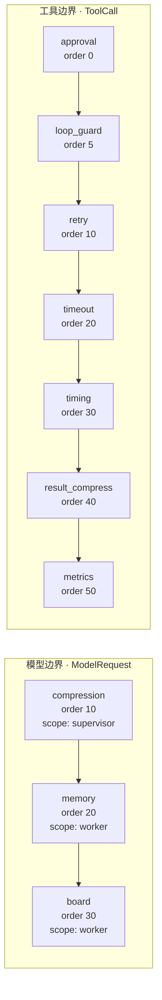

# 中间件链：横切关注点的有序化

Agent 的横切关注点天然会散开。本模块把它们收敛成**一条有序链**，
分别在「模型调用边界」和「工具调用边界」上运行。

> 实现：`middleware.py`｜兼容出口：`harness.py`｜观测：`GET /middleware`

---

## 为什么需要

原来这些能力的分布是这样的：

| 关注点 | 原来在哪 |
|---|---|
| 记忆注入 | `supervisor._make_worker_node` 里手写 |
| 黑板注入 | `supervisor._make_worker_node` 里手写 |
| 上下文压缩 | `supervisor._supervisor` 里直接调用 |
| 超时 / 重试 / 计时 | `harness.guarded_tool` 一个装饰器里套两层 |
| 结果卸载 | `compression`，在 RAG 工具内部调用 |
| 审批 | **每个工具自己写一遍**（rag_tool、expense_tool 各一份） |
| 循环守卫 | `AgentLoopGuard` 类存在，但**生产路径从没实例化过** |
| 用量统计 | 挂在 `astream_events` 事件层 |

问题不是「代码重复」，而是：

- 想调整顺序（「先压缩再注入记忆」）要改好几处，容易漏；
- 想在中间插一次预检，发现没有位置可以插；
- **强制执行依赖开发者记得**——新加一个工具时忘了加审批，没有任何机制拦得住；
- 「防死循环双保险」这句话在文档里写了，但其中一半**根本没接上**。

---

## 两种边界



---

## 工具边界链（7 层）

| order | 中间件 | 作用 | 为什么在这个位置 |
|---:|---|---|---|
| 0 | `approval` | 合规复核拦截（注册表模式） | **最先**——需要人工复核的操作根本不该开始执行 |
| 5 | `loop_guard` | 同一工具单次请求调用上限 | 在重试之前——否则重试会把调用次数翻倍 |
| 10 | `retry` | 有限重试（指数退避） | **在超时外层** → 每次重试都有独立超时 |
| 20 | `timeout` | 独立线程执行 + 超时 | 在计时内层——计时应该包含超时等待 |
| 30 | `timing` | 耗时日志 | 原 harness 的行为 |
| 40 | `result_compress` | 超长结果落盘，只留路径+哈希+预览 | **在结果进入消息流之前**收掉，比等发给模型时再压更省 |
| 50 | `metrics` | 工具级指标（次数/成功/失败/耗时） | 最外层——能统计到前面所有层的结果（含短路） |

### 洋葱模型（顺序即语义）

`call(call, next_fn)` 从外层到内层，返回时反向：

```
approval:in → loop_guard:in → retry:in → timeout:in → timing:in → result_compress:in → metrics:in
                                                                                            ↓ 真正执行
              ←  ←  ←  ←  ←  ←  ←  ←  ←  ←  ←  ←  ←  ←  ←  ←  ←  ←  ←  ←  ←  ←  ←  ←  ←
```

**为什么 `retry(10)` 必须在 `timeout(20)` 外层？**

因为我们要的语义是「**每次重试都有独立的超时**」。
如果反过来（超时在外），那就是「整个重试过程共享一次超时」——
第一次尝试把时间用掉之后，后续重试一开始就超时，等于没重试。

> 这也解释了为什么中间件不能简单实现成「before → 函数 → after」：
> `retry` 需要**多次调用后续链**。所以基类的 `call(call, next_fn)` 允许子类
> 完全接管调用，而不只是挂钩子。

---

## 模型边界链（3 层）

| order | 中间件 | scope | 作用 |
|---:|---|---|---|
| 10 | `compression` | **supervisor** | 路由请求视图：窗口截断 + 确定性压缩 |
| 20 | `memory` | worker | 长期记忆注入 |
| 30 | `board` | worker | 业务黑板摘要注入 |

### scope 过滤不是可选项，是设计

```python
assert [m.name for m in chain._models if "supervisor" in m.scopes] == ["compression"]
assert [m.name for m in chain._models if "worker" in m.scopes] == ["memory", "board"]
```

**路由绝不能注入记忆**：记忆里的词（「偏好」「项目」）会干扰路由令牌的匹配，
把路由带偏。这个问题原来靠「在 `_make_worker_node` 里写，不在 `_supervisor` 里写」
来保证 —— 是**人的约定**。现在是**类型约束**：`MemoryMiddleware.scopes = ("worker",)`。

**Worker 不需要压缩**：它只接收当前轮消息，本来就没有历史可压。

---

## 审批中间件：注册表模式

业务规则不写死在中间件里。工具通过 `register_guard()` 声明自己的审批条件：

```python
middleware.APPROVAL.register_guard("query_my_documents", _rag_approval_guard)
```

守卫返回一个 `ApprovalRequest`：

```python
@dataclass
class ApprovalRequest:
    need: bool = False
    kind: str = ""            # 复核类型（用于分层裁定）
    reason: str = ""          # 给人看的原因
    key: str = ""             # 匹配「已批准」记录的键
    record_name: str = ""     # 审批记录里的 tool_name
```

中间件负责完整的四步流程：**查已批准 → 消费一次 → 放行 / 挂起并短路**。

`key` 和 `record_name` 交给守卫指定，是为了兼容既有审批记录的格式 ——
**中间件不应该替业务决定「用什么当主键」。**

### 什么时候**不该**用这个中间件

`tools/expense_tool.py` 的复核**刻意没有迁移过来**。它的判定是：

```python
rule = rules.find_rule(description)      # 先查规则库
if rule: auto = True
...
if not auto:
    need, reason = hitl.needs_review("expense_classify", {...})
```

判定依赖「**规则库有没有命中**」这个工具内部算出来的中间结果，
而且复核通过后还要往黑板 `pending` 里写业务字段。

**这是业务逻辑，不是横切关注点。** 强行搬进中间件只会把业务规则泄露到横切层，
让中间件被迫知道 `rules` 和黑板的存在。

> 判断标准：**审批条件是否只依赖入参？**
> 是 → 适合上链；否 → 留在工具里。

---

## 循环守卫：从「文档里写着」到「真的接上」

`AgentLoopGuard` 这个类一直存在，文档里也写着「死循环双保险」，
但**生产代码里从来没有实例化过它** —— 只有测试在用。

现在由 `LoopGuardMiddleware` 挂进工具链，并且守卫按**请求**隔离：

```python
# agent.stream_chat
guard_token = new_loop_guard(
    max_turns=max(4, int(config.RECURSION_LIMIT)),
    max_tool_calls=int(config.LOOP_GUARD_MAX_TOOL_CALLS),
)
```

为什么必须按请求隔离：守卫里有一个 `tool_calls` 计数字典。
如果用模块级单例，并发下 A 请求调了 3 次 RAG，B 请求第 1 次就会被拦。

**没有设置守卫时中间件是 no-op** —— 这样单元测试和 CLI 场景不受影响。

---

## 与 cost_tracker 的分工

| | 中间件层 | 事件层 |
|---|---|---|
| 统计什么 | **工具调用**：次数 / 成功 / 失败 / 耗时 / 卸载数 | **token**：prompt / completion / 费用 |
| 挂在哪 | `MetricsMiddleware` | `astream_events` 的 `on_chat_model_end` |
| 为什么 | 工具可靠性 | 事件自带 `langgraph_node` 元信息，能分清钱是**路由**花的还是**某个 Worker**花的 |

**刻意不在中间件里做 token 记账**：会与事件层重复计数。

---

## 兼容出口

`harness.py` 现在是**薄适配层**，公开接口不变：

```
harness.with_timeout   → middleware.run_with_timeout
harness.with_retry     → middleware.run_with_retry
harness.AgentLoopGuard → middleware.AgentLoopGuard
harness.guarded_tool   → middleware.TOOL_CHAIN.run_tool
```

**没有重复实现**：超时线程池那段最容易写错（见下），只允许有一份。

> ⚠️ `run_with_timeout` 绝不能写成 `with ThreadPoolExecutor(...) as ex:`。
> `with` 退出时 `shutdown(wait=True)` 会等任务跑完，于是超时形同虚设
> （实测：6 秒任务设 2 秒超时，异常在 6.01 秒才出现）。
> 另一个坑：线程池**不自动继承 contextvars**，必须显式 `copy_context()`。

---

## 运维接口

`GET /middleware`：

```json
{
  "tool_chain": [
    {"name": "approval", "order": 0, "tools": ["*"]},
    {"name": "loop_guard", "order": 5, "tools": ["*"]},
    {"name": "retry", "order": 10, "tools": ["*"]},
    {"name": "timeout", "order": 20, "tools": ["*"]},
    {"name": "timing", "order": 30, "tools": ["*"]},
    {"name": "result_compress", "order": 40, "tools": ["*"]},
    {"name": "metrics", "order": 50, "tools": ["*"]}
  ],
  "tool_metrics": {
    "query_my_documents": {"calls": 12, "ok": 11, "fail": 1, "success_rate": 0.917, "avg_ms": 8420.5, "offloaded": 3}
  }
}
```

---

## 配置项

| 环境变量 | 默认 | 说明 |
|---|---|---|
| `LOOP_GUARD_MAX_TOOL_CALLS` | `3` | 同一工具单次请求调用上限 |
| `TOOL_TIMEOUT` | `30` | 单次工具执行超时（秒） |
| `TOOL_MAX_RETRIES` | `2` | 重试**总尝试次数** |
| `TOOL_RETRY_DELAY` | `1` | 指数退避初始延迟（秒） |

单工具覆盖：`TOOL_CHAIN.run_tool(fn, name, __timeout__=5, __max_retries__=1)`

---

## 测试

`tests/test_middleware.py`，24 项：

| 不变量 | 测试 |
|---|---|
| 洋葱顺序正确 | `test_tool_chain_onion_order` |
| 重试在外层（每次重试独立超时） | `test_retry_is_outer_so_each_attempt_has_own_timeout` |
| **超时真的超时**（不等任务跑完） | `test_run_with_timeout_actually_times_out` |
| contextvars 跨线程传播 | `test_run_with_timeout_propagates_contextvars` |
| 循环守卫超限拦截 | `test_loop_guard_blocks_after_limit` |
| 无守卫时 no-op | `test_loop_guard_noop_without_guard` |
| 中间件炸了不带崩主流程但留痕 | `test_model_middleware_failure_is_logged_not_fatal` |
| 原始消息不被就地修改 | `test_model_chain_does_not_mutate_input_messages` |
| scope 过滤生效 | `test_model_chain_scope_filtering` |
| 审批已批准时消费一次 | `test_approval_passes_and_consumes_when_already_approved` |
| 守卫写坏了放行而不是拦死 | `test_approval_guard_exception_does_not_block` |
| harness 兼容出口仍可用 | `test_harness_reexports_still_work` |

---

## 已知不足

| 不足 | 改进方向 |
|---|---|
| 中间件配置是全局的，不能按工具/租户分别配 | 支持按工具装配不同链 |
| metrics 是进程内计数，多实例各算各的 | 导出到 Prometheus / Redis |
| 无中间件耗时分解 | 每层记自己的耗时，定位是哪一层慢 |
| 审批守卫异常时静默放行 | 加「守卫连续失败」告警 |
| 模型边界只有 before 钩子 | 需要时补 `after_model`（注意别和事件层重复计数） |
