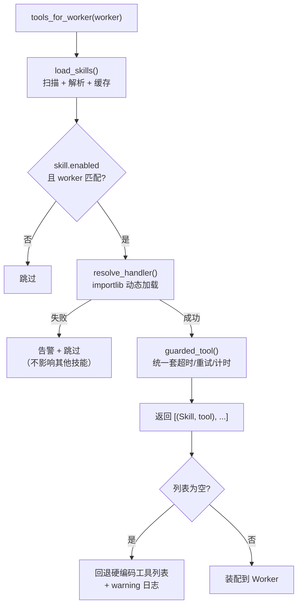

# 技能库与自动装配

把「工具 + 提示词 + 评测」打包成**可版本化的能力单元**，加能力 = 加一个目录，主流程代码零改动。

> 实现：`skills/registry.py`｜装配点：`supervisor._tools_for`

---

## 和「一堆函数」的区别

原来新增一个能力要改**三处**：

1. 在 `tools/` 写实现；
2. 在 `supervisor.SupervisorWrapper.initialize` 手工加进某个 Worker 的工具列表；
3. 在 `mcp_server.py` 补一个 `@mcp.tool()`。

改完还得记得同步文档 —— **漏一处就是线上事故**。

技能库把这件事变成声明式目录：

```
skills/
  policy_search/
    SKILL.md      ← 元数据（front matter）
    eval.json     ← 该技能自带的评测用例（可选）
  rd_ledger/
    SKILL.md
  ...
```

启动时：扫描目录 → 解析 front matter → 动态 import handler → 按 `worker` 字段自动装配。

---

## SKILL.md 格式

```markdown
---
name: policy_search
version: 1.0.0
description: 研发费用政策检索
when_to_use: 用户询问加计扣除、费用口径、高企认定、辅助账、留存备查等政策内容时
handler: tools.rag_tool:query_my_documents
worker: policy_agent
enabled: true
---

（正文：给模型看的补充说明）
```

解析用零依赖的简单 front matter 子集（`_parse_front_matter`），不引入 PyYAML。

**字段职责**：

| 字段 | 谁在用 |
|---|---|
| `description` / `when_to_use` | **模型** —— 决定它选不选这个工具 |
| `worker` | **装配器** —— 决定装给哪个 Agent |
| `handler` | **加载器** —— `"模块路径:属性名"` |
| `version` | **运维** —— 灰度与回滚 |
| `eval.json` | **测试** —— 改了这个技能该跑哪批用例 |

---

## 装配流程



**两条降级路径都是设计的一部分，不是冗余代码**：

1. 单个技能包写坏（缺 `description`、元数据非法）→ 只跳过它并告警；
   技能库是「可插拔」的，**插头坏了不该烧主板**。
2. 整个技能库装配失败 / 一个都没匹配上 → 回退到硬编码列表，
   但**必须打 warning，不能静默** —— 静默降级会让「技能没生效」变成
   「回答质量莫名其妙变差」这种极难排查的问题。

---

## 为什么这个设计值钱

| 性质 | 具体体现 |
|---|---|
| **可版本化** | 每个技能带 `version`，能力上线可灰度、可回滚 |
| **可评测** | `eval.json` 跟着技能走，改了这个技能就知道该跑哪批用例 |
| **可发现** | `list_skills()` 直接导出「系统当前具备哪些能力」；`GET /skills`、MCP、路由提示词都从**同一份元数据**生成 —— 不会出现代码和文档对不上 |
| **可插拔** | 新增能力 = 新增目录，`supervisor.py` 一行不改 |

---

## 与 MCP 的关系

同一个技能元数据可以被两个出口复用：

- **对内**：`supervisor._tools_for` 装配给 LangGraph Worker；
- **对外**：`mcp_server.py` 把核心能力暴露为标准 MCP 工具（stdio 传输）。

企业里的 ERP / 财务软件只要支持 MCP，就能直接调用这套能力，
不需要为本 Agent 单独写对接代码。

---

## 与「纯 markdown 技能包」的区别

生态里有另一种做法：Skill 就是**纯 markdown 知识文件**，零代码、零凭证，
通过包管理器分发（例如 `npx skills add owner/repo --skill <name>`）。

本项目的技能是**可执行的**（`SKILL.md` 元数据 + `handler` 指向真实模块 + `eval.json`）。
两者不是谁替代谁，而是两种产品形态：

- 纯 markdown：把**专家的方法论**打包给任何 AI 用；
- 本项目：把**已实现的能力**可插拔地装配给指定 Agent。

---

## 已知不足

| 不足 | 改进方向 |
|---|---|
| 无技能依赖声明 | 支持 `depends_on`，像 MCP 那样展开依赖 |
| 无激活状态机 | 现在靠 `worker` 字段全量装配，不支持「按需激活」 |
| 无 eval.json 自动执行 | 提供 `pytest --skills` 一键跑相关技能用例 |
